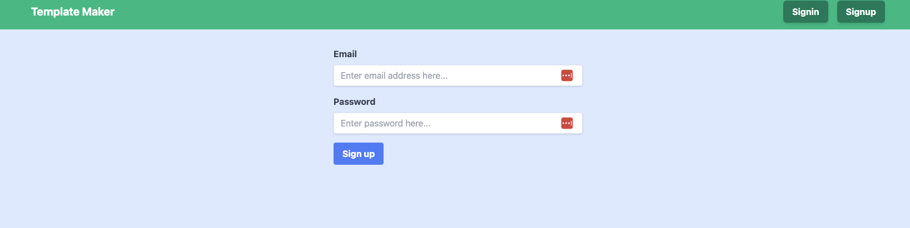
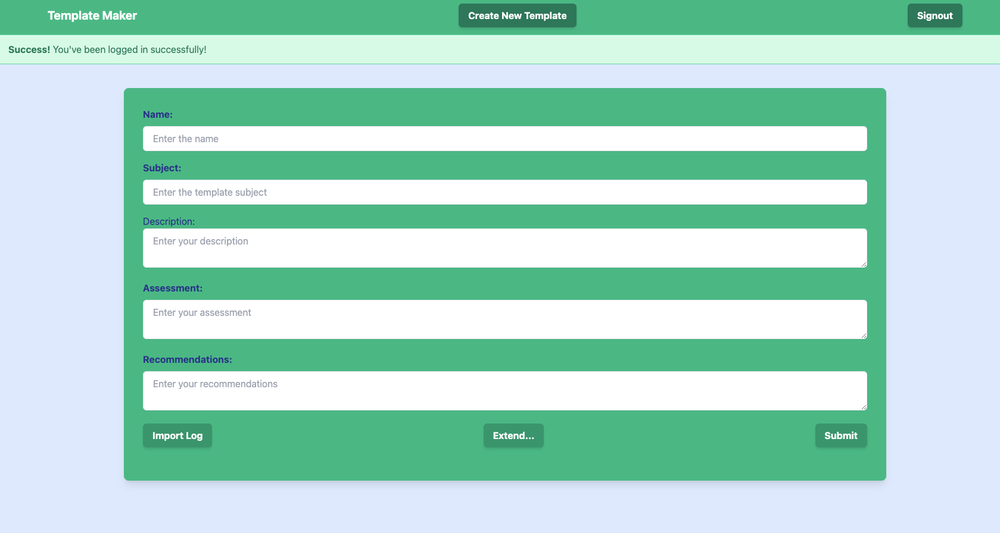
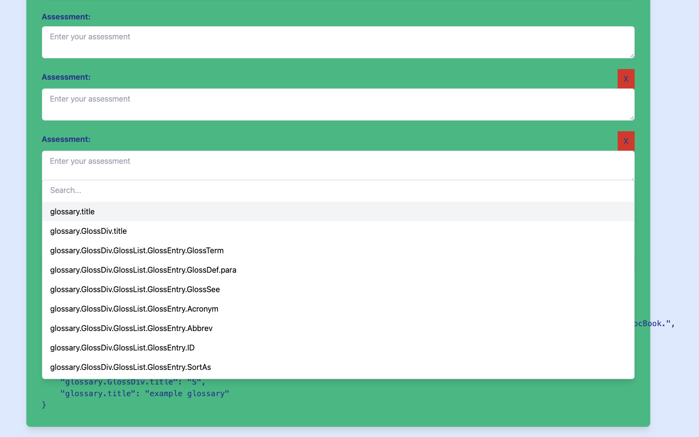
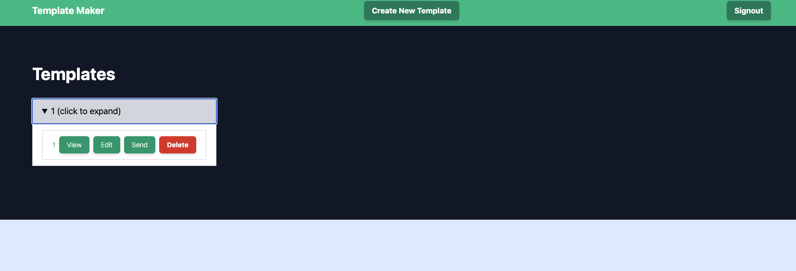

### Users Implemented

### Create and Edit Templates

### Ability to import logs and select keys

### Index viewing templates created by user

# TODO

- Implement tests
- Re-enable error checking on forms
- Implement TLS and secure headers